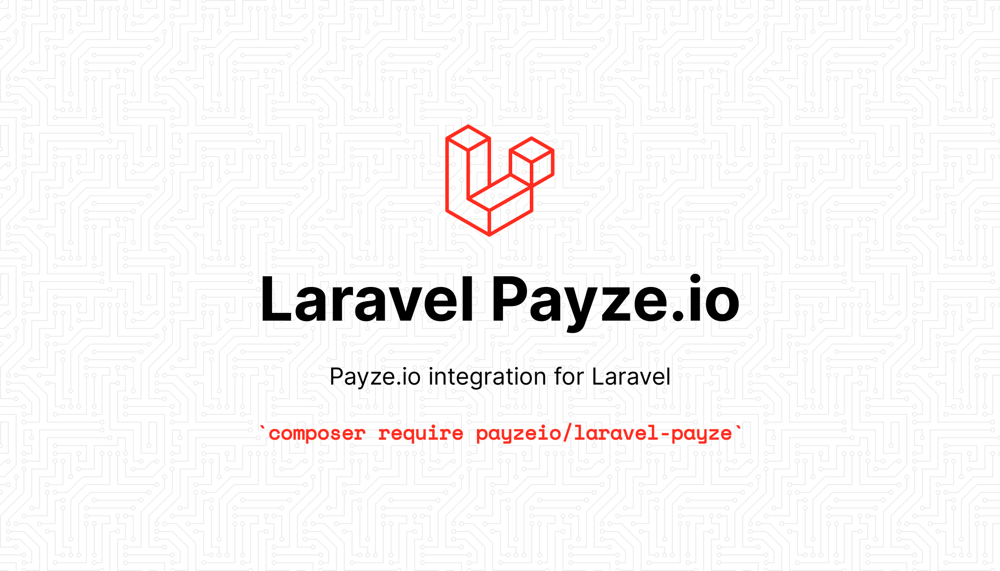

# Laravel Payze.io Integration Package

[](https://packagist.org/packages/payzeio/laravel-payze)
[](https://packagist.org/packages/payzeio/laravel-payze)
[](https://packagist.org/packages/payzeio/laravel-payze)

This package allows you to process payments with Payze.io from your Laravel application.



## Table of Contents

- [Installation](#installation)
    - [API Keys](#api-keys)
    - [Define Routes](#define-routes)
- [Config](#config)
    - [Log](#log)
    - [Routes](#routes)
    - [Views](#views)
    - [Transactions Table](#transactions-table)
    - [Logs Table](#logs-table)
    - [Card Tokens Table](#card-tokens-table)
    - [API Key](#api-key)
    - [API Secret](#api-secret)
- [Payments & Requests](#payments--requests)
    - [Just Pay](#just-pay)
    - [Add (Save) Card](#add-save-card)
    - [Pay with a Saved Card](#pay-with-a-saved-card)
    - [Commit](#commit)
    - [Refund](#refund)
    - [Transaction Info](#transaction-info)
    - [Merchant's Balance](#merchants-balance)
- [Payment Request Options](#payment-request-options)
    - [Amount](#amount)
    - [Currency](#currency)
    - [Language](#language)
    - [Preauthorize](#preauthorize)
    - [Associated Model](#associated-model)
    - [Split Money](#split-money)
- [Events](#events)
- [Relationships](#relationships)
    - [Transactions Relationship](#transactions-relationship)
    - [Cards Relationship](#cards-relationship)
- [Models](#models)
    - [Transaction Model](#transaction-model)
    - [Card Token Model](#card-token-model)
    - [Log Model](#log-model)
- [Authors](#authors)

## Installation

```
composer require payzeio/laravel-payze
```

#### For Laravel <= 5.4

If you're using Laravel 5.4 or lower, you have to manually add a service provider in your `config/app.php` file.
Open `config/app.php` and add `PayzeServiceProvider` to the `providers` array.

```php
'providers' => [
    # Other providers
    PayzeIO\LaravelPayze\PayzeServiceProvider::class,
],
```

Publish migrations and config by running:

```
php artisan vendor:publish --provider="PayzeIO\LaravelPayze\PayzeServiceProvider"
```

And run migrations:

```
php artisan migrate
```

### API Keys

Go to [Payze.io](https://payze.io) website and generate an API key. Place key and secret to .env file:

```
PAYZE_API_KEY=PayzeApiKey
PAYZE_API_SECRET=PayzeApiSecret
```

### Define Routes

You have to define success and fail routes in your application in order to finalize transactions. Go to your `web.php` (or wherever you store routes) and add the following:

```php
use PayzeIO\LaravelPayze\Facades\Payze;

// Other routes...

Payze::routes();
```

These routes will have the names `payze.success` and `payze.fail`. If you have defined them under some namespace, then you can update names in config. For example, if you defined payze routes in api.php and that file has the name `api.`, then your routes will be `api.payze.success` and `api.payze.fail`. Update them in `config/payze.php` file, stored in `routes` array.

## Config

The general variables are stored in `config/payze.php` file. More details:

### Log

Enable/disable database detailed logging on every request/transaction. By default, the log is enabled on the local environment only. You can override the value from `.env` or directly from the config file.

### Routes

Success and fail routes names, which are used to identify the finished transactions and update transaction status in the database.

Update route names only if you have defined routes in a different namespace (like `api`). For example you will have `api.payze.success` and `api.payze.fail` URLs.

### Views

Success and fail view names, which are displayed after a transaction is complete. You can override them and use your own pages with your own layout.

By default, it uses an empty page with just status text (green/red colors) and a "return home" button.

### Transactions Table

The name of the table in the database, which is used to store all of the transactions.

### Logs Table

The name of the table in the database, which is used to store detailed logs about transactions and API requests.

### Card Tokens Table

The name of the table in the database, which is used to store all of the saved card tokens.

### API Key

API key of your [Payze.io](https://payze.io) account.

### API Secret

API secret of your [Payze.io](https://payze.io) account.

## Payments & Requests

All of the requests are sent by corresponding classes, which extends the same class (PayzeIO\LaravelPayze\Concerns\ApiRequest).

All requests are called statically by `request()` function (passing constructor data), then chain all of the needed data and then `process()`.

Detailed instructions about needed data and options are in the [next section](#payment-request-options).

### Just Pay

If you need a one-time payment, then you should use the Just Pay function.

**Parameters:**

- `Amount` - `float`, required

**Return:** `Illuminate\Http\RedirectResponse`

```php
use PayzeIO\LaravelPayze\Requests\JustPay;

return JustPay::request(1)
    ->for($order) // optional
    ->preauthorize() // optional
    ->process();
```

### Add (Save) Card

Saving a card gives you a card token which you use for further manual charges without customer interaction. You can charge any amount and also save a card in one action, or you can set the amount to 0 to just save a card (Some banks may charge 0.1GEL and refund for saving a card).

Card tokens are saved in [database](#card-tokens-table) and can be accessed by [PayzeCardToken](src/Models/PayzeCardToken.php) model or [cards relationship](#cards-relationship).

After requesting a payment, a card token is created in a database with an inactive status. After a successful charge, the card token becomes active automatically.

**IMPORTANT!** If you want to associate a card token with the user and a transaction with an order, then you should use two requests: Save card with 0 amount for a user and then charge for an order with the saved card. This way, you will have a card token associated with the user and a transaction associated with an order.

**Parameters:**

- `Amount` - `float`, optional, default: `0`

**Return:** `Illuminate\Http\RedirectResponse`

```php
use PayzeIO\LaravelPayze\Requests\AddCard;

return AddCard::request(1)
    ->for($user) // optional
    ->process();
```

### Pay with a Saved Card

You can pay with a saved card token anytime without customer interaction.

Card tokens can be accessed by [PayzeCardToken](src/Models/PayzeCardToken.php) model or [cards relationship](#cards-relationship). Filter tokens by active status (with [`active()` scope](#active-scope))

**Parameters:**

- `CardToken` - `PayzeIO\LaravelPayze\Models\PayzeCardToken`, required
- `Amount` - `float`, optional, default: `0`

**Return:** `PayzeIO\LaravelPayze\Models\PayzeTransaction`

```php
use PayzeIO\LaravelPayze\Requests\PayWithCard;

// Get user's latest saved card
$card = $user->cards()->active()->latest()->firstOrFail();

return PayWithCard::request($card, 15)
    ->for($order) // optional
    ->process();
```

### Commit

Commit (charge) a blocked ([preauthorized](#preauthorize)) transaction.

**Parameters:**

- `TransactionId` - `string|PayzeIO\LaravelPayze\Models\PayzeTransaction`, required
- `Amount` - `float`, optional, default: `0`, (can be partially charged). 0 will charge full amount

**Return:** `PayzeIO\LaravelPayze\Models\PayzeTransaction`

```php
use PayzeIO\LaravelPayze\Requests\Commit;

return Commit::request($transaction)->process();
```

### Refund

Refund a [refundable](#refundable-scope) transaction.

**Parameters:**

- `TransactionId` - `string|PayzeIO\LaravelPayze\Models\PayzeTransaction`, required
- `Amount` - `float`, optional, default: `0`, (can be partially refunded). 0 will refund full amount

**Return:** `PayzeIO\LaravelPayze\Models\PayzeTransaction`

```php
use PayzeIO\LaravelPayze\Models\PayzeTransaction;
use PayzeIO\LaravelPayze\Requests\Refund;

$transaction = PayzeTransaction::refundable()->latest()->firstOrFail();

return Refund::request($transaction)->process();
```

### Transaction Info

Get transaction info and update in the database.

**Parameters:**

- `TransactionId` - `string|PayzeIO\LaravelPayze\Models\PayzeTransaction`, required

**Return:** `PayzeIO\LaravelPayze\Models\PayzeTransaction`

```php
use PayzeIO\LaravelPayze\Models\PayzeTransaction;
use PayzeIO\LaravelPayze\Requests\GetTransactionInfo;

$transaction = PayzeTransaction::latest()->firstOrFail();

return GetTransactionInfo::request($transaction)->process();
```

### Merchant's balance

Get balance info from the merchant's account.

**Return:** `array`

```php
use PayzeIO\LaravelPayze\Requests\GetBalance;

return GetBalance::request()->process();
```

## Payment Request Options

You can pass these parameters to all of the payment requests in Payze package.

### Amount

All payment requests have an amount in the constructor, but also there is a separate method for changing the amount.

```php
use PayzeIO\LaravelPayze\Requests\JustPay;

// Request 1 GEL originally
$request = JustPay::request(1);

// Some things happened, updating amount
return $request->amount(10)->process();
```

### Currency

You can change your payment's currency by calling `currency()` function on the request. Default: `GEL`

See supported currencies in [currencies enum file](src/Enums/Currency.php).

**Recommended:** Pass currency by using an enum instead of directly passing a string.

```php
use PayzeIO\LaravelPayze\Enums\Currency;
use PayzeIO\LaravelPayze\Requests\JustPay;

return JustPay::request(1)->currency(Currency::USD)->process();
```

### Language

You can change your payment page's language by calling `language()` function on the request. Default: `ge`

See supported languages in [languages enum file](src/Enums/Language.php).

**Recommended:** Pass language by using an enum instead of directly passing a string.

```php
use PayzeIO\LaravelPayze\Enums\Language;
use PayzeIO\LaravelPayze\Requests\JustPay;

return JustPay::request(1)->language(Language::ENG)->process();
```

### Preauthorize

Preauthorize method is used to block the amount for some time and then manually charge ([commit](#commit)) the transaction. For example, if you are selling products which have to be produced after the order, block (preauthorize) transaction on order and manually charge ([commit](#commit)) after your product are ready.

### Associated Model

You can associate any Eloquent model to a transaction by calling `for()` function on the request. For example, pass an order instance to a payment request for checking the order's payment status after payment.

```php
use App\Models\Order;
use PayzeIO\LaravelPayze\Requests\JustPay;

$order = Order::findOrFail($orderId);

return JustPay::request(1)->for($order)->process();
```

### Split Money

You can split the money into different bank accounts. For example, you have a marketplace where users sell their products and you get a commission for that. You can simply split transferred money easily instead of manually transferring from a bank account to a seller on every order.

You have to call `split()` function on the request, which accepts list/array of `PayzeIO\LaravelPayze\Objects\Split` object(s).

Split object has three parameters: `Amount`, `Receiver's IBAN`, and `Pay In (optional)` (delay in days before transferring the money).

For example, the cost of a product is 20GEL. You have to get your commission (10%) and transfer the rest to a seller.

```php
use PayzeIO\LaravelPayze\Objects\Split;
use PayzeIO\LaravelPayze\Requests\JustPay;

return JustPay::request(20)
    ->split(
        new Split(2, "Your IBAN"), // Transfer 2GEL immediately
        new Split(18, "Seller's IBAN", 3) // Transfer 18GEL after 3 days (for example, as an insurance before processing the order)
    )->process();
```

## Events

Events are fired after successful or failed transactions. You can [define listeners](https://laravel.com/docs/8.x/events#defining-listeners) in your application in order to mark an order as paid, notify a customer or whatever you need.

Both events have `$transaction` property.

Paid Event: `PayzeIO\LaravelPayze\Events\PayzeTransactionPaid`

Failed Event: `PayzeIO\LaravelPayze\Events\PayzeTransactionFailed`

## Relationships

You can add `transactions` and `cards` relationships to your models with traits to easily access associated entries.

### Transactions Relationship

Add `HasTransactions` trait to your model.

```php
use PayzeIO\LaravelPayze\Traits\HasTransactions;

class Order extends Model
{
    use HasTransactions;
}
```

Now you can access transactions by calling `$order->transactions`.

### Cards Relationship

Add `HasCards` trait to your model.

```php
use PayzeIO\LaravelPayze\Traits\HasCards;

class User extends Model
{
    use HasCards;
}
```

Now you can access saved cards by calling `$user->cards`.

## Models

### Transaction Model

You can access all transactions logged in the database by `PayzeIO\LaravelPayze\Models\PayzeTransaction` model.

Get all transactions:

```php
use PayzeIO\LaravelPayze\Models\PayzeTransaction;

PayzeTransaction::all();
```

#### Paid Scope

Filter paid transactions with `paid()` scope.

```php
use PayzeIO\LaravelPayze\Models\PayzeTransaction;

PayzeTransaction::paid()->get();
```

#### Unpaid Scope

Filter unpaid transactions with `unpaid()` scope.

```php
use PayzeIO\LaravelPayze\Models\PayzeTransaction;

PayzeTransaction::unpaid()->get();
```

#### Completed Scope

Filter completed transactions with `completed()` scope.

```php
use PayzeIO\LaravelPayze\Models\PayzeTransaction;

PayzeTransaction::completed()->get();
```

#### Incomplete Scope

Filter incomplete transactions with `incomplete()` scope.

```php
use PayzeIO\LaravelPayze\Models\PayzeTransaction;

PayzeTransaction::incomplete()->get();
```

#### Refundable Scope

Filter refundable transactions with `refundable()` scope.

```php
use PayzeIO\LaravelPayze\Models\PayzeTransaction;

PayzeTransaction::refundable()->get();
```

#### Non-Refundable Scope

Filter non-refundable transactions with `nonrefundable()` scope.

```php
use PayzeIO\LaravelPayze\Models\PayzeTransaction;

PayzeTransaction::nonrefundable()->get();
```

### Card Token Model

You can access all saved card tokens logged in the database by `PayzeIO\LaravelPayze\Models\PayzeCardToken` model.

Get all tokens:

```php
use PayzeIO\LaravelPayze\Models\PayzeCardToken;

PayzeCardToken::all();
```

#### Active Scope

Filter active card tokens with `active()` scope.

```php
use PayzeIO\LaravelPayze\Models\PayzeCardToken;

PayzeCardToken::active()->get();
```

#### Inactive Scope

Filter inactive card tokens with `inactive()` scope.

```php
use PayzeIO\LaravelPayze\Models\PayzeCardToken;

PayzeCardToken::inactive()->get();
```

### Log Model

You can access all logs from the database by `PayzeIO\LaravelPayze\Models\PayzeLog` model.

Get all logs:

```php
use PayzeIO\LaravelPayze\Models\PayzeLog;

PayzeLog::all();
```

## Authors

- [Levan Lotuashvili](https://github.com/Lotuashvili)
- [All Contributors](../../contributors)
